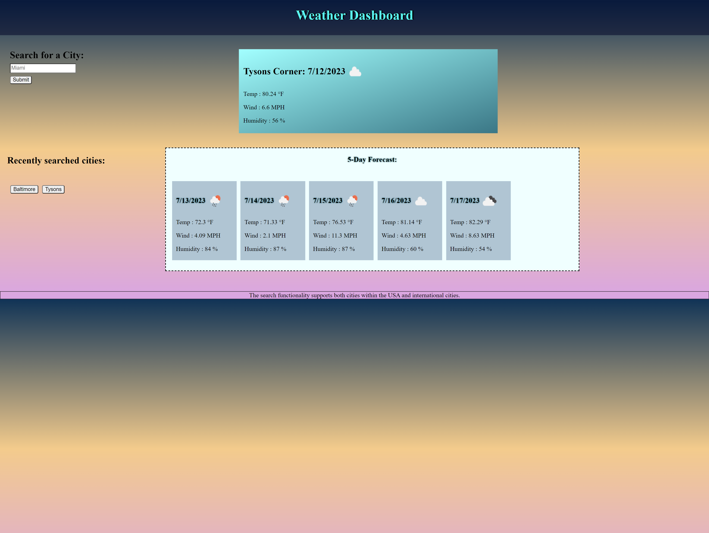

# Angelin_Weatherdashboard

## Application Overview
The Weather Dashboard is a user-friendly application that enables users to effortlessly search for and view weather information for any desired city. By simply entering the city name, users can access the current date's weather details, including the date, climate icon, temperature, wind speed, and humidity, all conveniently displayed on the screen. Additionally, the application provides a 5-day forecast to help users plan ahead.

To enhance user convenience, the Weather Dashboard features a "Recently Searched Cities" section. Whenever a city is searched, it is automatically added to this section, allowing users to quickly access the weather information for that city with just a click. This feature ensures that users can easily retrieve weather updates for their preferred cities whenever they need them.

## Website's Live URL - https://angelinrajan.github.io/Angelin_Weatherdashboard/

## Functionality of the website
* When users visit the website for the first time, they will encounter the following elements:
    1. Website title
    2. Search functionality:
        - A search box where users can enter the name of a city
        - A submit button to execute the search
    3. Recently searched cities section
* Upon entering a city name in the search input box and clicking the submit button, the current day's weather, along with a 5-day forecast, is displayed on the page for that specific city.
* The weather information includes details such as the city name, date, weather icon, temperature, wind speed, and humidity.
* The searched city is stored in local storage and presented as a button in the recently searched cities section.
* Clicking on a city button from the recently searched section generates the weather information for that city.
* The search functionality supports both cities within the USA and international cities.
Overall, the website provides users with a convenient way to search for and retrieve weather information for various cities, storing their recently searched cities for easy access.

## Deployment steps
1. Created a new repository on GitHub, including a README file.
2. Copied the SSH URL for cloning the repository.
3. Performed a Git clone command in my local environment (e.g., VS Code) using the copied SSH URL.
4. Regularly committed and pushed changes to keep the repository up to date.
5. After the final merge to the main branch, deployed the project from GitHub by navigating to the repository's settings, selecting "Pages," and choosing the main branch for deployment.
6. Tracked the progress and obtained the live website's URL within the Actions tab.
7. Clicking on the provided live website link directs users to the deployed website without any errors. (See screenshot below)

## API used
1. https://api.openweathermap.org

## Outside Resources used:
1. For input form: https://www.w3schools.com/html/html_forms.asp
2. button: https://www.w3schools.com/tags/tag_button.asp#:~:text=The%20tag%20defines%20a,with%20the%20element!
3. storage: https://www.w3schools.com/jsref/prop_win_localstorage.asp
4. obtain specific info from within response: https://idratherbewriting.com/learnapidoc/docapis_access_json_values.html#:~:text=Getting%20a%20specific%20property%20from%20a%20JSON%20response%20object,-JSON%20wouldn't&text=Instead%2C%20you%20select%20the%20exact,want%20from%20the%20JSON%20object.
5. Shadow: https://www.w3schools.com/css/css3_shadows.asp
6. Background fading: https://www.w3schools.com/css/css3_gradients.asp
7. Set Attribute: https://developer.mozilla.org/en-US/docs/Web/API/Element/setAttribute
8. Setting icons: https://openweathermap.org/weather-conditions
9. Fix Duplicate cities issue: https://www.reddit.com/r/learnjavascript/comments/zwi8s3/im_trying_to_prevent_adding_a_duplicate_value_to/
